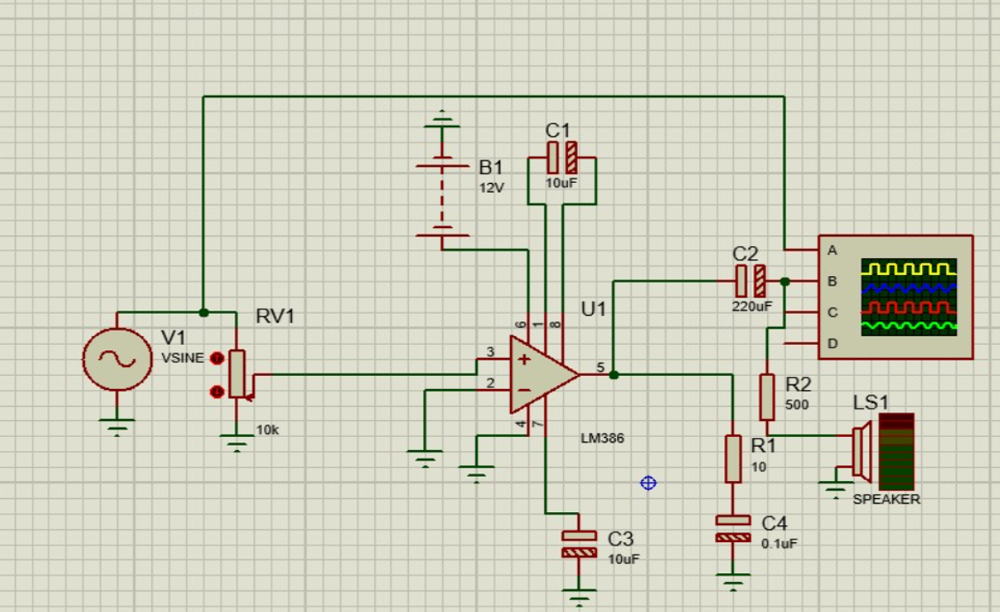
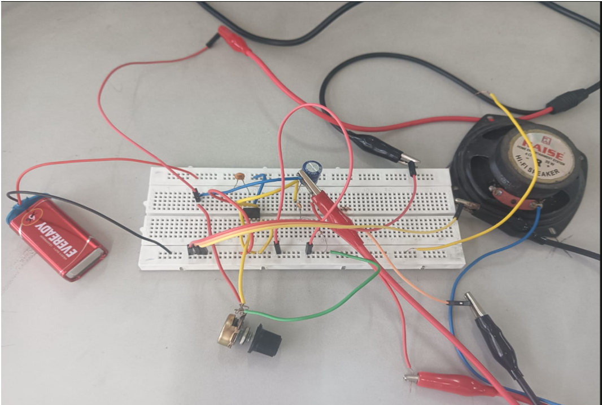
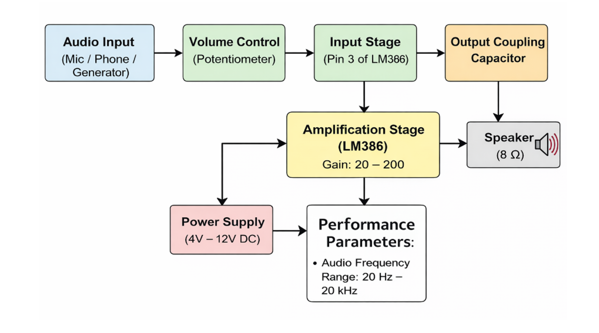

# Low Power LM386 Audio Amplifier

## Overview
This project presents the design and implementation of a low-power audio amplifier using the LM386 IC. The system amplifies weak audio signals and is suitable for portable and battery-operated applications due to its simplicity, efficiency, and low component count.

---

## Objective
- Amplify low-level audio signals (millivolt range)
- Produce clear audio output with minimal distortion
- Design a compact and cost-effective circuit
- Ensure compatibility with low-voltage portable systems

---

## Applications
- Portable audio devices  
- Small speaker systems (radios, toys, alarms)  
- Intercom systems  
- Battery-operated audio systems  
- Educational and laboratory experiments  

---

## Design Approach

### Input Stage
- Audio input is applied through a potentiometer (VR1)  
- Controls input amplitude (volume adjustment)  

### Amplification Stage
- LM386 IC performs signal amplification  
- Gain is adjustable using a capacitor between pins 1 and 8  
- Gain range: 20 to 200  

### Output Stage
- Output is passed through a coupling capacitor  
- Drives an 8Ω speaker  

### Stability and Noise Reduction
- Zobel network (resistor-capacitor) ensures frequency stability  
- Bypass capacitor reduces noise  

---

## Circuit Diagram

---

## Breadboard Implementation

---

## Block Diagram Image

---

## Components Required
- LM386 Audio Amplifier IC  
- Potentiometer (10kΩ recommended)  
- Capacitors (gain, coupling, bypass)  
- Resistors (for Zobel network)  
- Speaker (8Ω)  
- DC Power Supply (4V–12V)  

---

## Specifications

### Electrical Specifications
- Input Signal: Low-level AC audio  
- Input Voltage: 10 mV – 200 mV  
- Supply Voltage: 4V – 12V DC  
- Extended Voltage: up to 18V (LM386N-4)  
- Gain: 20 (default) to 200 (adjustable)  
- Load Impedance: 4Ω – 32Ω  
- Output Power: Up to 1W  

---

### Performance Parameters
- Frequency Range: 20 Hz – 20 kHz  
- Low total harmonic distortion  
- Low quiescent current consumption  
- Stable operation with minimal external components  
- Preserves signal fidelity  

---

### Safety and Reliability
- Low-voltage operation  
- Internal thermal protection  
- Short-circuit tolerant output  
- Suitable for battery-powered systems  

---

## Load Test Calculation

Given:
Vpp = 7.2V  

Step 1: Peak Voltage  
Vp = Vpp / 2 = 3.6V  

Step 2: RMS Voltage  
Vrms = Vp / √2 ≈ 2.55V  

Step 3: Output Power (for 8Ω load)  
P = Vrms² / R ≈ 0.81W  

---

## Results
- Successfully amplified weak audio signals  
- Achieved clear and stable sound output  
- Compact and efficient design  
- Performance validated through load testing  

---

## Future Scope
- PCB design for compact implementation  
- Integration with Bluetooth or wireless modules  
- Use in portable speaker systems  
- Efficiency improvement using advanced amplifier classes  

---

## Conclusion
The LM386-based audio amplifier is a simple, economical, and efficient solution for amplifying audio signals. Its low power requirement and minimal component usage make it ideal for both academic and practical applications.

--
